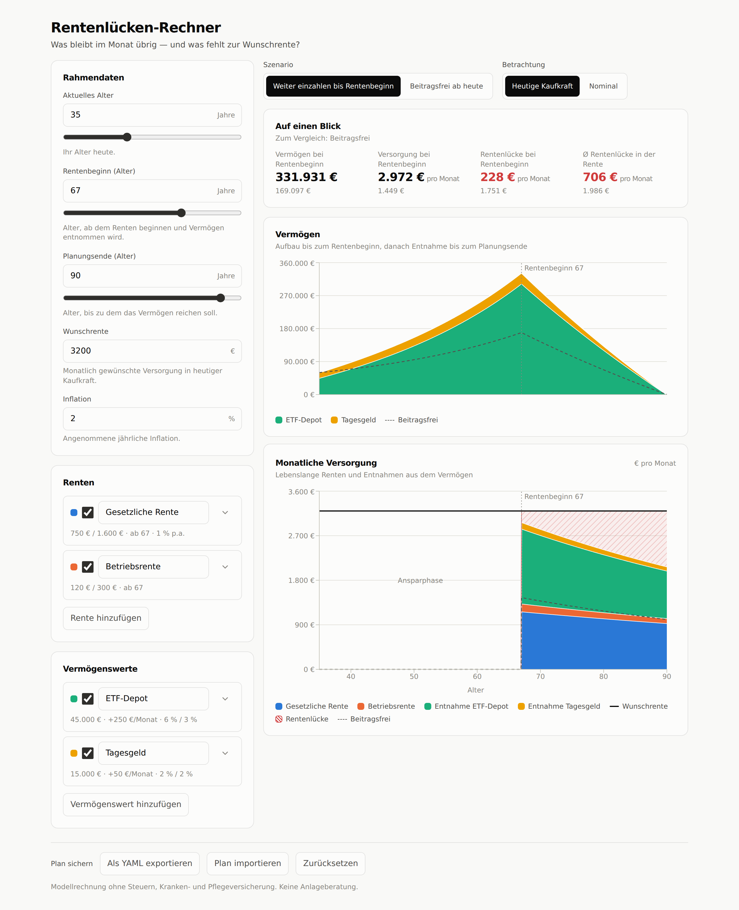

# rentenluecke

Ein kleiner statischer Rechner für die **Rentenlücke**: Wie viel Geld steht im
Monat zur Verfügung — und wie viel fehlt zur Wunschrente?

**Live:** https://realjohndoe.github.io/rentenluecke/



Die Seite zeigt zwei übereinanderliegende Diagramme mit gemeinsamer Altersachse:

- **Vermögen** in € — Aufbau bis zum Rentenbeginn, danach Entnahme bis zum
  Planungsende.
- **Monatliche Versorgung** in € pro Monat — lebenslange Renten und Entnahmen aus
  dem Vermögen, gestapelt, darüber die Wunschrente. Die schraffierte Fläche
  dazwischen ist die Rentenlücke.

Das Modell ist deterministisch: Renten wachsen mit ihrer eigenen jährlichen
Steigerung, Vermögenswerte verzinsen sich in der Ansparphase und in der
Entnahmephase mit je eigener Rendite und werden ab Rentenbeginn linear bis zum
Planungsende auf null abgebaut (Annuität), und die Wunschrente wird optional mit
der Inflation hochgerechnet. Zwei Szenarien lassen sich vergleichen — Beiträge
bis zum Rentenbeginn fortführen oder ab heute beitragsfrei stellen — und Beträge
wahlweise in heutiger Kaufkraft oder nominal anzeigen. Der Plan lässt sich als
YAML exportieren, wieder importieren und auf den Beispielplan zurücksetzen; er
wird nebenbei im Browser zwischengespeichert. Modellrechnung ohne Steuern,
Kranken- und Pflegeversicherung. Keine Anlageberatung.

## Entwicklung

```bash
npm install
npm run dev        # Entwicklungsserver
npm test           # Tests der Finanzmathematik
npm run typecheck
npm run format     # Prettier über den Quellcode (`format:check` in CI)
npm run build      # statischer Build nach dist/
```

## Aufbau

| Pfad | Inhalt |
|---|---|
| `src/model/` | Datenmodell und Finanzmathematik — reine Funktionen, ohne React |
| `src/components/` | Diagramme und UI |
| `src/components/ui/` | Bausteine ohne Fachlogik: `Card`, `Button`, `IconButton` |
| `src/hooks/` | geteilter Zustand: aufgeklappte Einträge, Media Queries, Fokus nach dem Hinzufügen |
| `src/index.css` | Farbtoken für hell und dunkel, als Tailwind-Utilities |
| `.prettierrc.json` | verbindlicher Codestil; `npm run format:check` läuft in CI |
| `src/i18n/de.ts` | sämtliche deutschen Texte |
| `plan.md` | Umsetzungsplan für die noch offenen Ausbaustufen |

Code, Bezeichner und das JSON/YAML-Format sind englisch; nur die Oberfläche ist
deutsch.

## Deployment

`.github/workflows/deploy.yml` prüft jeden Push und Pull Request (Format,
Typecheck, Tests, Build) und veröffentlicht `main` auf GitHub Pages. Einmalig
nötig:
Repository → Settings → Pages → Source auf **GitHub Actions** stellen.
